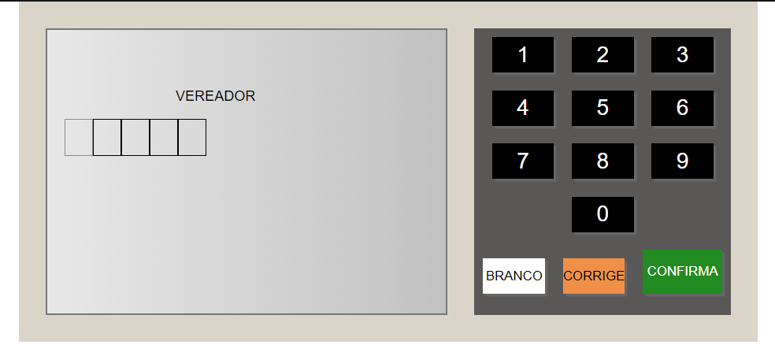

<h1 align="center">Urna-Eletronica</h1>

Um simulador da urna eletrônica brasileira. O script recebe um arquivo JSON contendo as etapas da eleição, bem como os candidatos disponíveis para o voto.

<h4 align="center"> 
	🚧  React Select 🚀 Em construção...  🚧
</h4>
<h1></h1>
https://fnicom.github.io/Urna-Eletronica/
<h1 align="center">
  
</h1>

### 🛠 Tecnologias

As seguintes ferramentas foram usadas na construção do projeto:

- HTML
- JavaScript
- CSS
- TypeScript
- VsCode
- Git

